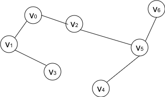

## 实验三：图的遍历和设备更新问题

    李一鸣                  					1160300625

### 1. 图的遍历

在Graph.h中实现了结构体、类:

1. AdjList  
    顶点的邻接矩阵。

    成员变量有:
    + int subscript: 起始点u所在的下边
    + bool visited: 点u是否已访问过
    + vectot<int> adjacencies: 与u邻接的所有点v(即存在边<u, v>)
    + int indegree, outdegree: 点u的入度和出度
2. Graph(模板)   
    没有考虑带权图，所有边的权值都当做1处理。  
    虽然是以有向图写出来的，对无向图，只要输入的邻接矩阵是对称阵，仍然适用。  

    成员变量有:
    + vector<Printable> vertices: 存储顶点表示的值，如"v0"、"北京"等等
    + vector<AdjList> adjLists: 对每个顶点，都要有相应的邻接表
    

图的遍历采用两种方式:

1. DFS(Depth First Search):

+ 递归
    - a. 将所有顶点标记为未访问
    - b. 遍历所有顶点(连通分量)
        - c. 对给定的顶点，若未访问:
            - d. 将其设置为已访问，打印
            - e. 对其所有邻接点重复c 
+ 非递归 
    - a. 将所有顶点标记为未访问
    - b. 遍历所有顶点(连通分量)
        - c. 对给定的顶点v，若未访问则将其压入栈中
        - d. 做下列循环直至栈空
            - e. u出栈，将其设置为已访问，打印
            - f. 对u的每个邻接点，若未访问，则压入栈中

2. BFS(Breadth First Search):

    - a. 将所有顶点标记为未访问
    - b. 遍历所有顶点(连通分量)
        - c. 对给定的顶点v，若未访问则将其入队
        - d. 做下列循环直至栈空
            - e. u出队，将其设置为已访问，打印
            - f. 对u的每个邻接点，若未访问，则将其入队

输入样例:  
||
|:--:|
|图1-无向图样例|

运行结果:

    Building graph...
    The adjList of your Graph is : 
    v0 : v1 v2 
    v1 : v0 v3 
    v2 : v0 v5 
    v3 : v1 
    v4 : v5 
    v5 : v2 v4 v6 
    v6 : v5 
    
    DFS result is : 
    v0 v1 v3 v2 v5 v4 v6 
    DFS non-recursively, result is : 
    v0 v1 v3 v2 v5 v4 v6 
    
    BFS result is : 
    v0 v1 v2 v3 v5 v4 v6 
    

### 2. 设备更新问题

思路:  
+ 顶点i表示第i年开始使用的新设备  
+ (i, j)表示设备从第i年开始使用，到j年更新，边上的权数就是期间所需的总费用 

求解过程:  
1. 输入每年购进新设备的价格p、不同时间的维修费c  
2. 根据上述信息构建图  
    例如: 对5年进行规划  
    + v[0]表示第一年，v[1]表示第二年，以此类推    
    + d[0,1] = p[0] + c[0], d[0, 2] = p[0] + c[0] + c[1], d[2, 4] = p[2] + c[0] + c[1]，以此类推有d[i, j] = p[i] + c[0] + ... + c[j-i-1]  
    + 应该构建6个顶点，要求最小费用，即是求从v[0]-v[5]的最短路径  
3. Dijkstra算法求最短路径    
    + 初始化距离dist[0] = 0, dist[...] = INFINITY  
    + 运用BFS，对v[0]所在的连通分量进行搜索(v[0]入队)，当队列非空:    
        - u出队，讲u标记为已访问  
        - 对u所有所有未访问过的临接点w:  
            - 若dist[w] > dist[v] + d[v, w]，更新w的最短路径，w入队  

Dijkstra算法的思想是贪心算法，每次出队的顶点所求得的距离一定是最短的。  

输入样例:

||
|:--:|
|图2-设备更新样例|

运行结果:

	初始样例为: 
	n = 5
	prices = [ 11 11 12 12 13 ]
	repairCost = [ 5 6 8 11 18 ]
	构造出的邻接矩阵为: 
		      0             16             22             30             41             59
	     2147483647              0             16             22             30             41
	     2147483647     2147483647              0             17             23             31
	     2147483647     2147483647     2147483647              0             17             23
	     2147483647     2147483647     2147483647     2147483647              0             18
	     2147483647     2147483647     2147483647     2147483647     2147483647              0
	最短时间为: 53
	购进新设备的时间为: 1 3 

	请输入年数n: 4
	请输入1-4年年初的设备价格: 
	5 6 7 8
	请输入使用不同时间的设备所需的维修费用: 
	5 5 5 5
	构造出的邻接矩阵为: 
		      0             10             15             20             25
	     2147483647              0             11             16             21
	     2147483647     2147483647              0             12             17
	     2147483647     2147483647     2147483647              0             13
	     2147483647     2147483647     2147483647     2147483647              0
	最短时间为: 25
	购进新设备的时间为: 1 

	请输入年数n: 

