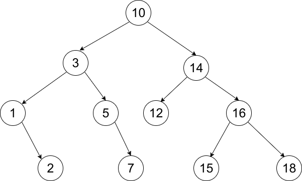
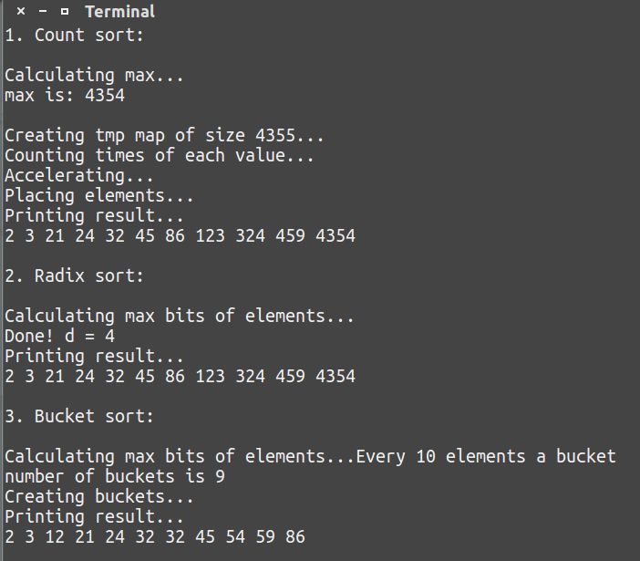
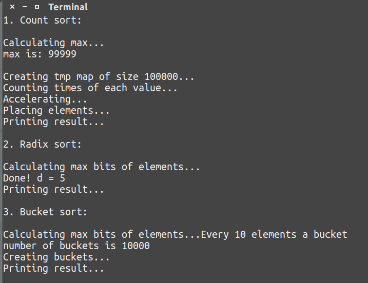

# 实验四

            姓名: 李一鸣                    学号: 1160300625

## 1. 二叉搜索树的查找、插入、建立、删除

样例:

||
|:--:|
|*图1-BST*|

### 结点定义为模板类Node:

重复节点计数。

|数据域|意义|
|-|-|
|key|关键字大小|
|left|指向左孩子的指针|
|right|指向右孩子的指针|

#### 构造函数:

`Node(Comparable value, Node *lchild = nullptr, Node *rchild = nullptr);`

#### <重载函数:

`bool operator < (const Comparable & t);`

### 模板类BST:

|数据域|意义|
|-|-|
|root|根结点|
|num|结点个数|

#### 查找函数:

1. 若待查找关键字(key)等于当前节点(node)关键字，返回当前节点。
2. 若待查找关键字(key)小于当前节点(node)关键字，递归查找node的左子树。
3. 若待查找关键字(key)大与当前节点(node)关键字，递归查找node的右子树。
4. 若node没有相应的子树，返回`nullptr`。

#### 插入函数:

(对于已存在的结点，插入直接cnt++即可)

1. 若当前结点(node)为`nullptr`，使当前结点指向以待插入关键字(key)为关键字的新建结点。
2. 若待插入关键字(key)小于当前结点(node)关键字，递归插入node的左子树。
3. 若待查找关键字(key)大与当前结点(node)关键字，递归插入node的右子树。

#### 构造函数:

初始化`num`，不断插入`keyArray`中的元素，直至建好树。

删除最小值函数:
(对于cnt>0的节点，删除直接cnt--即可)
1. 若当前结点(node)没有左子树，删除当前结点，用其右结点接替。
2. 否则，递归删除当前结点的左子树。

#### 删除指定元素值函数:

若当前结点非`nullptr`(否则删除失败，元素不存在):

1. 若待删除关键字(key)小于当前结点(node)关键字，递归删除node的左子树。
2. 若待删除关键字(key)大于当前结点(node)关键字，递归删除node的右子树。
3. 等于
+ 3.1 若node无左子树，删除当前结点，用右子树接替。
+ 3.2 若node无右子树，删除当前结点，用左子树接替。
+ 3.3 若node有左右子树，删除右子树中的最小元素，放入node中(覆盖原有key值)。

<pre>
    Constructing BST using int:{10, 14, 3, 1, 5, 12, 2, 7, 16, 15, 18}...
    Deleting 10 from BST...
    Deleting min sequentially...
    1 2 3 5 7 12 14 15 16 18 
</pre>

## 2. 快排的优化

### 模板类QuickSort

|数据域|意义|
|-|-|
|arr|待排序数组|

#### 构造函数

初始化arr数组

#### find函数

找到合适的`pivot`下标，对于[3 3 3 2 ...]返回0，对于[3 3 4 5 ...]返回2。即第一个或第二个不重复元素的下标。

对于下标从i到j的块，取第一个元素作为`first`，对arr[k]属于arr[i+1, j]进行循环:
1. 若arr[k] == `first`, 继续循环
2. 若arr[k] > `first`，返回k
3. 若arr[k] < `first`，返回i 

若数组元素全部相同，为终止条件，返回-1。

#### parti函数

按照`pivot`将arr[i, j]划分为两块。

`ii`从`i`开始递增、`jj`从`j`开始递减，一旦发现arr[ii] >= arr[pivot]且arr[jj] < arr[pivot]，且`ii`<`jj`，交换两元素。

返回右子序列下标。

#### sort函数

找到arr[i, j]块的`pivot`，若为-1，终止。

否则分块之后递归sort左右两块。

#### 尾递归优化sort函数

较大半块递归实现，较小半块利用迭代实现。

    testing 1...
    testing 2...
    testing 3...
    testing 4...
    testing 5...
    testing 6...
    testing 7...
    testing 8...
    testing 9...
    testing 10...

    10 test cases, for each test 50000integers
    on everage 15600.9 us = 15.6009 ms per case

    testing 1...
    testing 2...
    testing 3...
    testing 4...
    testing 5...
    testing 6...
    testing 7...
    testing 8...
    testing 9...
    testing 10...

    10 test cases, for each test 50000integers
    After optimizing, on everage 15028.6 us = 15.0286 ms per case

## 3. 线性排序: 计数排序、基数排序、桶排序

### 3.1 计数排序

计数排序的基本思想是对每一个输入元素x，确定出小于x的元素的个数。

然后再将x直接放置在它在最终输出数组中的位置上。

时间复杂度O(n)。

限制: 只能排序正整数，在数据大小相差很大时，浪费空间。

### 3.2 基数排序

基数排序是从低位到高位依次对所有的数进行排序。

如果最大数有d位，那么先按最低有效位数字进行排序，得到一个结果。然后往高位重复这个过程。

时间复杂度O(n)。

限制: 只能排序正整数。

### 3.3 桶排序

将区间[0,maxOfArr]分成n个相同大小为10的子区间，或称为桶。然后将n个输入元素分布到各个桶中去。

每个桶中的元素用一个变长数组来存储。在输入时对每个桶中的数据进行排序，然后遍历每个桶，按照次序把各个桶中的元素列出来即可。

桶排序假设输入数据服从均匀分布，因此每个桶中的数据量相差不多，平均情况下它的时间代价为O(n)。

主要用来排序浮点数，可以将整数部分相同的元素放入同一桶中。

||
|:--:|
|图2-线性排序|

||
|:--:|
|图3-50000用例测试线性排序|

    1. Count sort: 

    testing 1...
    testing 2...
    testing 3...
    testing 4...
    testing 5...
    testing 6...
    testing 7...
    testing 8...
    testing 9...
    testing 10...

    10 test cases, for each test 50000integers
    on everage 253177 us = 253.177 ms per case

    2. Radix sort: 

    testing 1...
    testing 2...
    testing 3...
    testing 4...
    testing 5...
    testing 6...
    testing 7...
    testing 8...
    testing 9...
    testing 10...

    10 test cases, for each test 50000integers
    on everage 14671 us = 14.671 ms per case

    3. Bucket sort: 

    testing 1...
    testing 2...
    testing 3...
    testing 4...
    testing 5...
    testing 6...
    testing 7...
    testing 8...
    testing 9...
    testing 10...

    10 test cases, for each test 50000integers
    on everage 31514.1 us = 31.5141 ms per case

可见基数排序快于桶排序快于计数排序。
