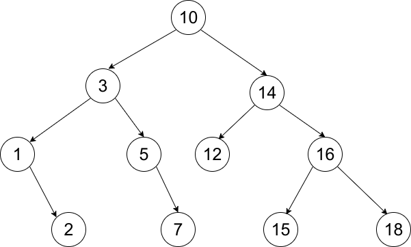

# 实验四

            姓名: 李一鸣                    学号: 1160300625

## 1. 二叉搜索树的查找、插入、建立、删除

样例:

结点定义为模板类Node:

|数据域|意义|
|-|-|
|key|关键字大小|
|left|指向左孩子的指针|
|right|指向右孩子的指针|

构造函数:

`Node(Comparable value, Node *lchild = nullptr, Node *rchild = nullptr);`

<重载函数:

`bool operator < (const Comparable & t);`

模板类BST:

|数据域|意义|
|-|-|
|root|根结点|
|num|结点个数|

查找函数:

1. 若当前节点(node)关键字等于待查找关键字(key)，返回当前节点。
2. 若当前节点(node)关键字小于待查找关键字(key)，递归查找node的右子树。
3. 若当前节点(node)关键字等于待查找关键字(key)，递归查找node的左。
