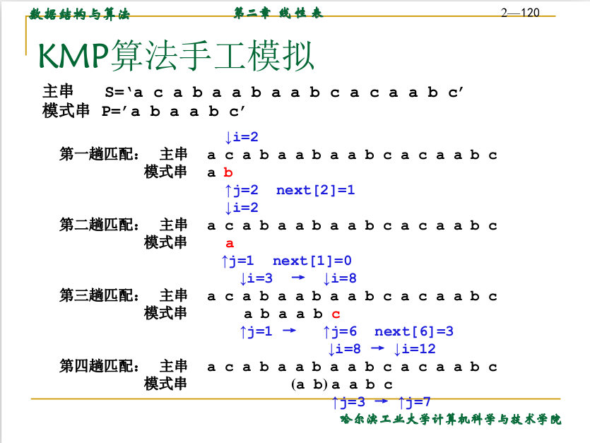

## 第2章 线性表

### 2.1 线性表的抽象数据类型

线性表是由n(n≥0)个相同类型的元素组成的有序集合。

线性表 LIST = ( D , R)
元素  
D = { a_i | a\_i ∈ Elementset , i = 1, 2, ..., n, n ≥ 0 }  

元素的前后关系  
R = { H }  

a\_i-1在a\_i之前  
H = { <a_i-1 , a_i > | a_i-1 , a\_i ∈ D , i = 2 , ... , n }
    
### 2.2 线性表的实现

#### 2.2.1 顺序表

```c
# define maxlength 100
struct LIST {
    elementtype elements[maxlength];
    int last;
};
LIST L;
L.elements[p] // L的第p个元素
L.last L的长度,最后元素的位置
```

连续的存储空间(数组)

    Insert(x, p, L)     // 插入   O(n)
    Locate(x, L)        // 定位   O(n)
    Retrieve(p, L)      // 取值   O(1)
    Delete(p, L)        // 删除   O(n)
    Previous(p, L)      // 前驱   O(1)
    Next(p, L)          // 后继   O(1)
    Makenull( L)        // 置空   O(1)
    First( L)           // 取首   O(1)
    End(L)              // 取尾   O(1)

#### 2.2.2 单链表

```c
struct celltype {
elementtype element ;
celltype *next ;
} ; //结点型

typedef celltype *LIST; //线性表的型

typedef celltype *position; //位置型
```

每个结点均含有两个域:存放元素的**信息域**和存放其后继结点的**指针域**。

    Insert(x, p, L)     // 插入   O(1) < 顺序表 （插入在p之后不是p处、头结点的作用）
    Locate(x, L)        // 定位   O(n) 
    Retrieve(p, L)      // 取值   O(1)
    Delete(p, L)        // 删除   O(1) < 顺序表
    Previous(p, L)      // 前驱   O(n) > 顺序表
    Next(p, L)          // 后继   O(1)
    Makenull( L)        // 置空   O(1)
    First( L)           // 取首   O(1)
    End(L)              // 取尾   O(n) > 顺序表

|比较|顺序表|单链表|
|-|-|-|
|容量|固定|可变|
|存取|随机|顺序|
|时间|插入、删除耗时|前驱、取尾耗时|
|空间|浪费|节省|

#### 2.2.3 静态链表

把线性表的元素存放在**数组**的单元中(不一定按逻辑顺序连续存放),每个单元不仅存放元素本身,而且还要存放其后继元素所在的数组单元的下标(**游标**)。

```c
类型定义:
typedef struct {
    elementtype element ;
    int next ;
} spacestr; //结点类型
cursor av; //游标变量,标识线性表
spacestr SPACE[ maxsize ] ;//存储池
typedef int position,cursor;
```

#### 2.2.4 双向链表

在单向链表中,对每个结点增加一个域,用一指向该结点的前驱结点。

### 2.3 栈

#### 2.3.1 栈的数组实现

栈的容量:maxlength – 1 ;  
栈空:S.top = 0 ;  
栈满:S.top = maxlength – 1 ;  
栈顶元素:S.elements[ S.top ] ;  

#### 2.3.2 栈的指针实现

与线性链表的表头插入和删除元素相同。

### 2.4 队列

#### 2.4.1 队列的指针实现

每个元素有一个指针域，指向下一个元素。

front：队首  
rear：队尾

#### 2.4.2 队列的数组实现

假溢出：随着不断有元素出队和进队(插入和删除),前面部分位置空闲。

解决方法：  
1. 通过不断移动元素位置,每当有元素出队列时,后面的元素前移一个位置,使队头元素始终占据队列的第一个位置。
2. 采用**循环队列**。
    插入元素:
    Q.rear = (Q.rear + 1) % maxlength
    删除元素:
    Q.front = (Q.front + 1) % maxlength

    此时又出现问题：  
    队空:front==rear  
    队满:front==rear  
    
    解决方法：  
    方法一:约定队列头指针在队列尾指针的下一位置上(即空出一个位置);  
    方法二:另设一个标志位用以区别队空与队满两种状态;  
    
### 2.5 串（string）

#### 2.5.1 抽象数据型串

    string MakeNull( ) ;
    Boolean IsNull ( S ) ;
    void In( S, a ) ;
    int Len( S ) ;
    void Concat( S1, S2 ) ;
    string Substr( S, m, n ) ;
    Boolean Index( S, S1 ) ;

#### 2.5.2 串的实现

1. 串的顺序存储
2. 串的链式存储---定长结点
3. 模式匹配算法
    + Brute-Force算法  
    + KMP算法
        主串不回溯,模式就需要向右滑动一段距离。  
        利用已经得到的“部分匹配”的结果将模式向右“滑动”尽可能远的一段距离(next[j])后,继续进行比较
        
        ||
        |:--:|
        |KMP手工模拟|

### 2.6 数组（array）

#### 2.6.1 数组的抽象数据类型

#### 2.6.2 数组的实现

1. 数组的顺序存储
2. 特殊矩阵的压缩存储

    + 相同的元素只分配一个存储空间
    + 零元素不分配存储空间
    
    对称阵：左下  
    三角阵：左下正常，右上分配一个元素  
    稀疏阵：(行号,列号,非零元素值)——三元组表  
3. 数组的链接式存储

### 2.7 广义表

递归定义：广义表是由零个**原子**（不可再分）,或若干个原子或若干个广义表组成的有穷序列。

长度:直接元素的个数;  
深度:括号的最大嵌套层数。
表头:广义表LS非空时,称第一个元素为LS的表头;
表尾:广义表LS中除表头外其余元素组成的广义表。


